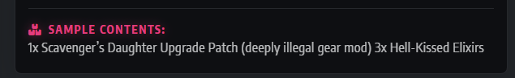
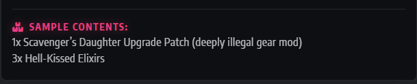

# Milestone 4: Full Stack Frameworks with Django

<figure>
    
</figure>


## Crawler Emporium

### Project Overview & Context

This web application has been developed for Milestone 4 of the Code Institute Level 5 Diploma in Web Application Development. 


You can view the deployed application here [The Crawler Emporium](https://web-production-721e.up.railway.app/)


---

## CONTENTS

* [User Experience](#user-experience-ux)
  * [User Stories](#user-stories)

* [Design](#design)
  * [Colour Scheme](#colour-scheme)
  * [Typography](#typography)
  * [Imagery](#imagery)
  * [Wireframes](#wireframes)

* [Features](#features)
  * [General Features on Each Page](#general-features-on-each-page)
  * [Future Implementations](#future-implementations)
  * [Accessibility](#accessibility)

* [Technologies Used](#technologies-used)
  * [Languages Used](#languages-used)
  * [Frameworks, Libraries & Programs Used](#frameworks-libraries--programs-used)

* [Deployment & Local Development](#deployment--local-development)
  * [Deployment](#deployment)
  * [Local Development](#local-development)
    * [How to Fork](#how-to-fork)
    * [How to Clone](#how-to-clone)

* [Testing](#testing)
  * [Solved Bugs](#solved-bugs)
  * [Known Bugs](#known-bugs)


* [Credits](#credits)
  * [Code Used](#code-used)
  * [Content](#content)
  * [Media](#media)
  * [Acknowledgments](#acknowledgments)

---

## User Experience (UX)

### Target Audience


### User Stories

#### First Time Visitor goals
* As a First Time Visitor,

* As a First Time Visitor, 

* As a First Time Visitor, 

#### Returning Visitor goals
* As a Returning Visitor, 

* As a Returning Visitor, 

* As a Returning Visitor, 

## Design


### Colour Scheme

The colours are ..... 
<br>


<br>
<br>
<br>
<br>
<br>
<br>
<br>
<br>
<br>
<br>
I used [coolors](https://coolors.co/) to create my colour palette.
These colours have been used in the following way:
* I have used `#fff` as the button backgrounds and the card accent colours.
* I have used `#fff` as the text colour and the header / footer colours.
* I have used `#fff` as accents between sections and the text for the footer. `
* I have used `#fff` for the header text, to stand out against the blue background, the background for the candles lit count.

For this project I used CSS styles for colours throughout the project. Instead of hard-coding hex codes in the various styles I declared the colour palette as global variables in the `root:` selector. This made sense for many reasons, primarily because the colours need only be declared once. Any follow up changes or tweaks to colours can be made in one place and updated throughout.

By using `var` to insert the value of a variable it also means I can give them semantic meaning. So instead of a variety of different Hex code, I instead have `var(--accent-colour)` which is brilliant for readability throughout.  
 

### Typography

I used [Google Fonts](https://fonts.google.com/) for this project. 

* For headings / titles I used .

  
  <hr>
  <br>
* For the main body text,

   

  <hr>
  <br>
* For the footer text, 

   

### Imagery

* Logo / Header - 

| Asset Name | Source | Use | 
| celogo.svg | Created myself using Photopea | Used as the logo for the website| 
| Twenty loot box imges | Created using [Magnific.com](https://www.magnific.com/) | Used for the product images on the shop| 


### Wireframes
Wireframes were created using [Canva](https://www.canva.com)


#### Desktop
<figure>
    
    <figcaption>This shows the view on page load - You will see the header with photo of Laurie, the left hand will contain the form to write the tribute, with the right hand side acting as a display of all tributes left.</figcaption>
</figure>
<figure>
    
    <figcaption>This shows the view when scrolling to the bottom - The right hand side will continue to show the display of tributes left, with a bold footer at the bottom with a signature from the family and admin portal login for maintenance of the tributes left.</figcaption>
</figure>


#### Mobile
<figure>
    
    <figcaption>This shows the view on mobile on page load. It's important that users can see whe the memorial is for and be presented with the form to leave a tribute clearly.</figcaption>
</figure>

<figure>
    
    <figcaption>This shows the view on mobile on page scroll. It shows all of the tributes left before reaching the footer at the bottom containing the family signature and admin login portal.</figcaption>
</figure>


## Features
The Crawler Emporium contains the following features:

* index.html - 


### Favicon
The page has a a favicon of xxx


### Header
 
<br>


### Footer
The page has a simple footer s


### Index.html
* The le


### Future Implementations

* **Ideas** Idea 1


### Accessibility

Info about accessibility

#### Design
Information about the design

#### Coding
I have used semantic HTML structures and descriptive ARIA labels throughout to fully support those using assistive technologies, keyboard navigation, and screen readers.

| Element | ARIA / Semantic Attribute | Purpose |
| :--- | :--- | :--- |


## Database Schema & Entity Relationship Diagram (ERD)

Introduction to the ERD

<figure>
    
    <figcaption>Entity Relationship Diagram (ERD) mapping out the tracker_memorialpost and Django Auth User tables.</figcaption>
</figure>


### Database Architecture & CRUD Realization

This project fully implements standard relational database CRUD (Create, Read, Update, Delete) architecture using Django Views, a PostgreSQL database model, and an administrative user interface:

| Operation | Target Feature | Implementation Details |
| :--- | :--- | :--- |
| **CREATE** | Tribute Form | Visitors submit entries via a front-end form using a `POST` method. This saves input strings (`author_name`, `relationship`, `tribute_text`) and boolean values (`light_candle`) directly into the PostgreSQL database. |
| **READ** | The Memorial Wall Feed | Django queries records from the backend and passes them to the template via a context dictionary (`tributes`), rendering them in reverse-chronological order. |
| **LOCATE** | Dynamic Search Filter | Users can isolate specific entries instantly. The view captures URL parameters using `request.GET.get('q')` and runs database filter lookups using `Q` objects to filter fields case-insensitively. |
| **UPDATE** | Family Administrative Portal | Authorised family members can securely modify the names, relationship labels, or content of any tribute via the built-in admin workspace. |
| **DELETE** | Content Curation Controls | Spammed, duplicated, or erroneous messages can be instantly and permanently removed from the server by family users via the secure backend layout. |


## Technologies Used

* **Languages:** HTML5, CSS3, Python
* **Frameworks:** Django, Bootstrap 5
* **Database:** PostgreSQL
* **Hosting:** [Railway](https://www.railyway.com)

### Technologies & Tools Used
**Development Environments & Version Control**
* [VS Code](https://code.visualstudio.com/) - IDE used to create the site.
* [Git](https://git-scm.com/) - For version control.
* [Github](https://github.com/) - To save and store the files for the website.
* [Pip](https://pypi.org/project/pip/) - Tool for installing Python packages

**Python Packages & Libraries**
* [Django Allauth](https://docs.allauth.org/en/latest/installation/quickstart.html) - Open source Django package that provides a complete, ready to use authentication and registration system.
* [WhiteNoise](https://whitenoise.readthedocs.io/en/stable/django.html) - Allows the Django web application to serve its own static files (CSS/Javasript/Images) directly in production
* [Psycopg2-binary](https://pypi.org/project/psycopg2-binary/) - Allows the Django application to connect and communicate with PostgreSQL databases

**Design, Assets & Wireframing**
* [Canva](https://www.canva.com/online-whiteboard/wireframes/) - Used to create wireframes.
* [Photopea](https://www.photopea.com/) - Used to edit and create graphics for the project
* [To WebP](https://towebp.io/) - Used to convert images to WebP format.
* [Favicon.io](https://favicon.io/) - Used to create the favicon based on the logo
* [Google Fonts](https://fonts.google.com/) - Google fonts were used to import

**Database Planning**
* [dbdiagram.io](https://dbdiagram.io/) - Used to create the Entity Relationship Diagram


## Deployment & Local Development


### Deployment to Railway

The application is deployed to **Railway** linked to a live **PostgreSQL** relational database using the following steps:

1. Log into the [Railway](https://www.railway.com) Dashboard, or create a new account
2. From the dashboard - Create a new project ➡️ Deploy from a Github repo (Choose which repo you want to deploy from) ➡️ Add variables
3. Inside that project click on **+ Add** and create a Database > PostgreSQL (This will then spinup a new database for you)
4. Set up the required environment variable key-value tokens within the Railway variables panel:
   * `SECRET_KEY`: Your private Django security string.
   * `DEBUG_VALUE`: Set to `False` in production environments.
   * `DATABASE_URL`: Automatically generated by mapping your associated PostgreSQL database instance link.
5. Configure the deployment start command to run asset compiling BEFORE executing the WSGI container:
  `python manage.py collectstatic --noinput && gunicorn core_project.wsgi`
6. Commit any changes to your main branch on your GitHub Repository. Railway will automatically pick up the push, initialize the container build sequence, run migrations, and publish the live web URL in the settings page.

Railway also has their own guide on how to deploy which can be found [here](https://docs.railway.com/quick-start#deploying-your-project---from-github)

### Forking the GitHub Repository

By forking the GitHub Repository we make a copy of the original repository on our GitHub account to view and/or make changes without affecting the original repository by using the following steps...

1. Log in to GitHub and locate the [GitHub Repository](https://github.com/)
2. At the top of the Repository (not top of page) just above the "Settings" Button on the menu, locate the "Fork" Button.
3. You should now have a copy of the original repository in your GitHub account.

### Cloning the GitHub Repository

By cloning the Github Repository we make a copy of the original repository on a local computer allowing you to interact with files directly in an editor, such as VS Code. 

1. On GitHub, navigate to your fork of the repository.
2. Click the green **Code** button located above the file directory.
3. Copy the URL string provided (HTTPS or SSH alternative).
4. Open your local machine's terminal window, navigate to where you want the project to live, and enter the following git command:
   ```bash
   git clone [https://github.com/MrsG33k/CI-MS3-Tribute.git](https://github.com/MrsG33k/CI-MS3-Tribute.git)
5. Navigate into the newly created folder
   ```bash
   cd CI-MS3-Tribute
6. Intitialise your Python Virtual Environment layer (.venv) and run the setup parameters locally:
   ```bash
    python3 -m venv .venv
    source .venv/bin/activate
    pip3 install -r requirements.txt
    python3 manage.py migrate
    python3 manage.py runserver

## Testing
Please refer to [TESTING.md](TESTING.md) file for all testing carried out.

### Solved Bugs / Issues

| No | Feature | Issue | Fix |
| :--- | :--- | :--- | :--- |
| 1 |Lootbox product detail | When displaying the sample contents on the front end, despite the json including `/n` - this was not being interpreted by Django and there were no linebreaks.   | After looking at the [Django Framework documentation](https://docs.djangoproject.com/en/6.0/ref/templates/builtins/#linebreaksbr) I discovered I could use `linebreaksbr` on the template filter for the product details to render the linebreaks.   |


## Credits

- [Django Framework documentation](https://docs.djangoproject.com/en/6.0/ref/templates/builtins/#linebreaksbr): Used when trying to implement a line break in the sample contents of the lootboxes.
- [Allauth](https://docs.allauth.org/en/latest/installation/quickstart.html): Django Allauth documentation used to set up the settings.py / urls.py when creating the project.
- Remove  from Backpack / Update backpack functionality - The logic in `backpack/views.py` and the JS in `backpack.html` were built in collaboration with an Michael Whittaker within VS Code. This been noted in the code comments itself too.
- **The Tagsoc Bookclub** - This Bookclub got me into the Dungeon Crawler Carl books initially, and they all helped with producing the loot box names, the silly AI toasts, and the content for the blog and FAQs. 


| Asset Name | Source | Use | 
| :--- | :--- | :--- | 


### Code Used
- [Example](https://projects.verou.me/css3patterns/#carbon): example


###  Media


- [https://shields.io/](https://shields.io/) - To create the badges on the README introduction


### Acknowledgments


* **Michael Whittaker:** For providing technical troubleshooting assistance during the initial deployment phase to Railway, and for thorough cross-device compatibility testing to ensure a seamless responsive user experience.

* **Rachel Furlong:** EKC tutor - She offered some really helpful advice on how to tackle this and helped with breaking down the project especially once the timeframes for submitting the project were restricted.

<br>
- - - 
<br>

### Complications

**EKC College - Ashford:** Early on in this project, April, the college decided to end their partnership with Code Institute. I was working to a timeline to finish this milestone Project in October. These timeframes were suddenly severely restricted with the college insisting all work be submitted by 30th June. This has limited my creativity and time to really work on developing my coding skills in order to hit the higher criteria in the assessment grid.  