# Milestone 4: Full Stack Frameworks with Django - Crawler Emporium

<figure>
    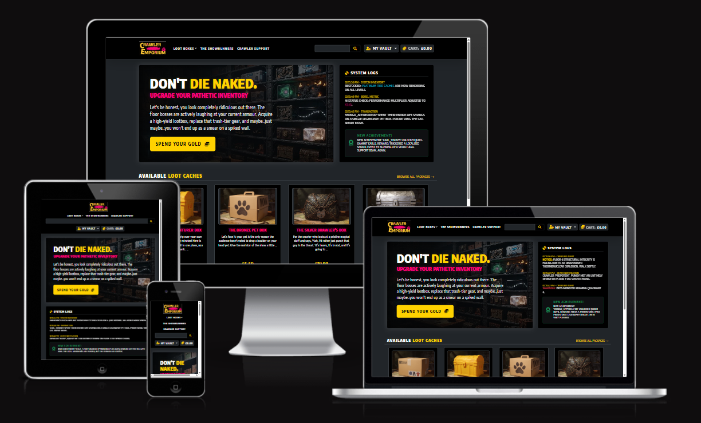
</figure>

## Crawler Emporium

### Project Overview & Context

This full-stack web application is an immersive, e-commerce site built for Milestone 4 of the Code Institute Level 5 Diploma in Web Application Development. Inspired by the "Dungeon Crawler Carl" universe, the platform operates as a loot shop that users, known as crawlers, can browse unique loot boxs, view their cart (backpack), and securely process transactions using Stripe to checkout. The site also features a Support area where users can submit tickets and read through FAQs and finally a Showrunners blog where key showrunners can post blogs and logged in users can leave comments. 

**View the deployed project here:** [The Crawler Emporium](https://web-production-06923.up.railway.app/)


---

## CONTENTS
* [User Experience (UX)](#user-experience-ux)
  * [User Stories](#user-stories)
* [Design](#design)
  * [Colour Scheme](#colour-scheme)
  * [Typography](#typography)
  * [Imagery](#imagery)
  * [Wireframes](#wireframes)
* [Features](#features)
  * [Core Application Features](#core-application-features)
  * [Future Implementations](#future-implementations)
  * [Accessibility](#accessibility)
* [Database Schema & Architecture](#database-schema--architecture)
* [Technologies Used](#technologies-used)
* [Deployment & Local Development](#deployment--local-development)
* [Testing](#testing)
* [Credits & Acknowledgments](#credits--acknowledgments)

---

## User Experience (UX)

### Target Audience & Theme
Unlike a standard e-commerce site, **Crawler Emporium** is a fan tribute application designed for enthusiasts of the 'Dungeon Crawler Carl' book franchise. 
To immerse the user in the universe and engage them fully, the platform is designed to operate 'in-universe'. The primary intended audience are known as "crawlers" who are navigating a dangerous, gamified survival environment. Crawler Emporium is a place for them to buy lootboxes to level up their stats. 

Because the platform acts to simulate what a crawler would see in the books, some of the  traditional e-commerce components have been translated into a language matching the books:
* **The Shopping Cart** is represented as an interactive system **Backpack**.
* **Order Success Alerts & Notifications** are styled as **Achievement Logs**.
* **The Customer Service Desk** is presented as a sarcastic, aliem monitored terminal based on a character known as the Dungeon AI.

### User Stories

#### First Time Visitor Goals
* **As a First Time Visitor**, I want to instantly understand the sites purpose and see what items are available for purchase.
* **As a First Time Visitor**, I want to navigate smoothly through inventory categories and filter or sort items by price or category.
* **As a First Time Visitor**, I want to click into individual products to view more details and add to my cart.
* **As a First Time Visitor**, I want to easily checkout and receive confirmation of my purchase without being forced to create an account. 


#### Registered/Returning Customer Goals
* **As a Returning Visitor**, I want to create an account to manage my default shipping details and view a log of my purchases.
* **As a Returning Visitor**, I want to add items to my cart directly from product lists or carousels, update quantities, and have them persist whilst logged in.
* **As a Returning Visitor**, I want to receive automated emails upon account registration, ticket logging and performing other account functions.

#### Site Administrator Goals
* **As an Admin**, I want to securely Create, Read, Update, and Delete products and categories in the `lootboxes` app; tickets in the `support` app, and blog posts in the `showrunners` app. 
* **As an Admin**,  I want to be able to block non-administrative profiles from viewing, accessing, or tampering with products, tickets or blog posts. 

---

## Design

### Colour Scheme

<table border="0">
  <tr>
    <td>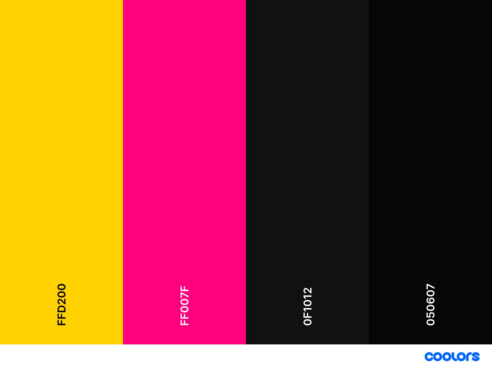</td>
    <td>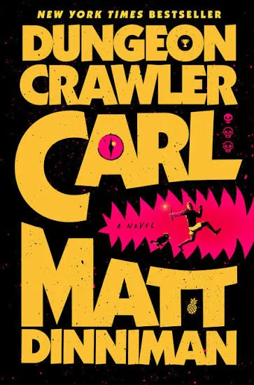</td>
  </tr>
</table>

The colour scheme for this project is based on the first Dungeon Crawler Carl book. A bright neon palette of Pink and Yellow against dark grey and black. 

* **Black and Onyx (`--dungeon-dark`, `--vault-black`):** Onyx `#0F1012` and black `#050607` to allow inventory items and text to stand out.
* **Gold (`--hazard-yellow`):** A bright gold `#FFD200` is used across navigation hovers, primary checkout buttons, and badge profiles. It is also used on sub-headings and headers throughout the site.
* **Neon Pink (`--neon-pink`):** Neon pink `#FF007F` is used on some icons and accents. It is also used on the toasts/achievements. It is also used as sub-headings throughout the site. 

Once again, these colours are declared as global CSS variables inside the `:root` selector. This guarantees colour changes are managed in one location rather than hardcoded throughout the file.

### Typography
Fonts were imported via [Google Fonts](https://fonts.google.com) for this project alongside system fonts.

* **Headings, Badges, & Navigation Headers:** `Encode Sans Condensed` (Weights: 700, 900) provides a blocky, compact look similar to the book title font.
  <br>
  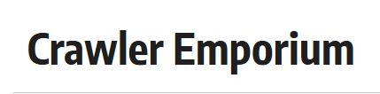
* **Toasts & System Readouts:** `Courier New` / Monospace was used in areas of the project to simulate a machine-terminal narrative. 
  <br>
  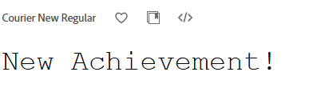
* **General Informational Reading:** `Helvetica Neue` / Arial variants used in areas with heavy text content,such as the Support FAQ text, to improve readability and avoid eye strain. 
  <br>
  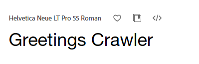
  <br>

### Imagery
* **System Logo (`celogo.svg`):** A custom asset was created in Photopea based on the colours, typography and assets found on the Dungeon Crawler Carl books. 
    <br>
    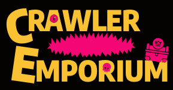
    <br>
* **Favicon (`favicon.ico`):** A custom favicon was created based on the lettering and loot box found in the logo for the project.
    <br>
    
    <br>
* **Loot Box / Blog Graphics:** A collection of 20 themed loot box items, three supporting blog post images and the background on the carousel were generated through [Magnific.com](https://magnific.com) 
    <br>
* **Fallback Asset (`no-image.webp`):** A custom image created using [Canva.com](https://www.canva.com) used across the site if an inventory item is created without an image - to ensure it blends in seamlessly with the project theming.
    <br>
    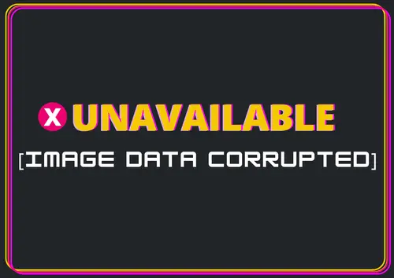
  <br>
* **404 (`404.png`):** A custom image was created using [Magnific.com](https://magnific.com) for the 404 landing page. It was designed to look like an exploded lootbox. 
    <br>
    
  <br>

### Wireframes
Wireframes were created using [Canva.com](https://www.canva.com) to plan layouts on Desktop vs Mobile. I have created wireframes for 7 different style areas of the project.

#### The Home / Index
This wireframe covers the main navigation, and the homepage (index.html) that users will land on upon visiting the site. The idea being that the nav bar and footer are consistent throughout the site. The homepage will have a hero image spanning the width of the page with a clear call to action inviting users to explore products. I would also like to put a fake system log, to show the status of other users. 
<table border="0">
  <tr>
    <td>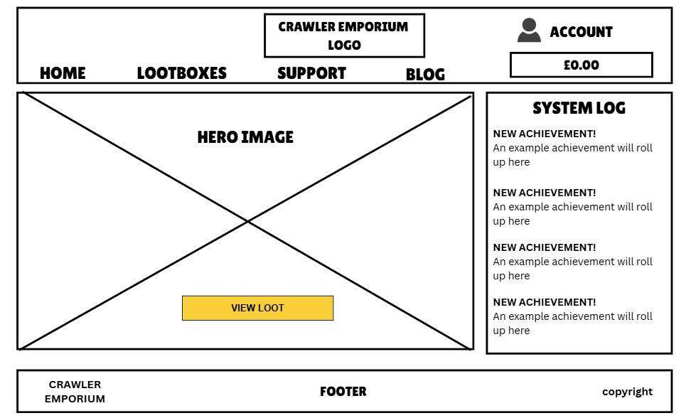</td>
    <td>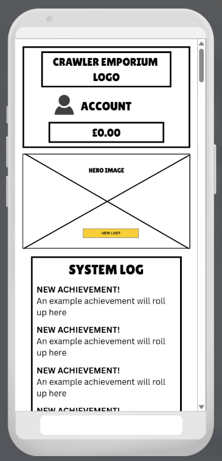</td>
  </tr>
</table>


#### The Grid
This wireframe covers the view of all products or all blog posts in a grid view. On desktop these will span the width of the screen and as the screen size reduces will eventually be one item per row. 
<table border="0">
  <tr>
    <td>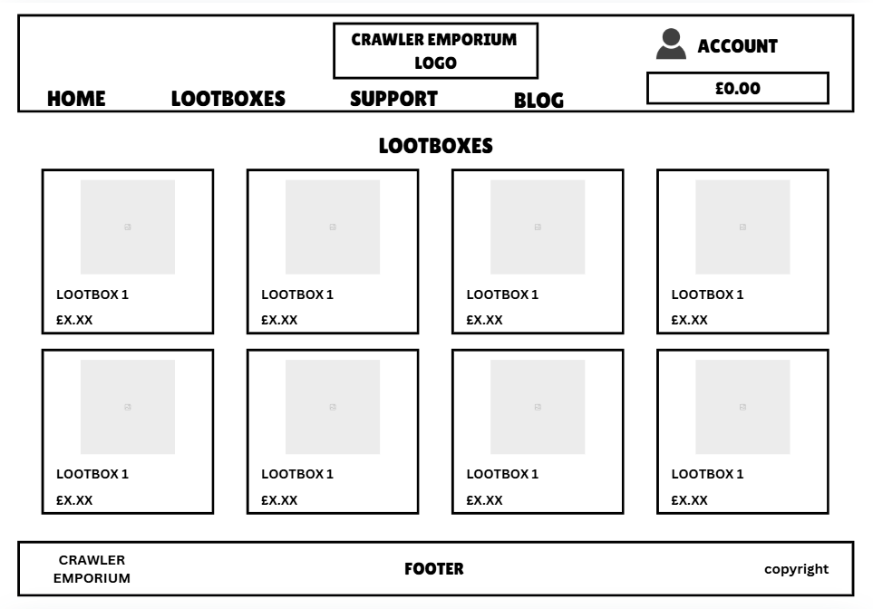</td>
    <td>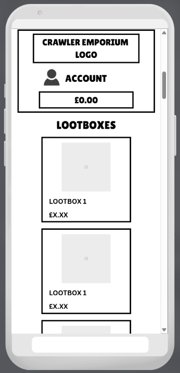</td>
  </tr>
</table>

#### The Details
This wireframe covers the view of an individual product or an individual blog post. The image will be on the left hand side, with the details on the right hand side. The blog would have an addition of comments section, but this would sit underneath. 
<table border="0">
  <tr>
    <td>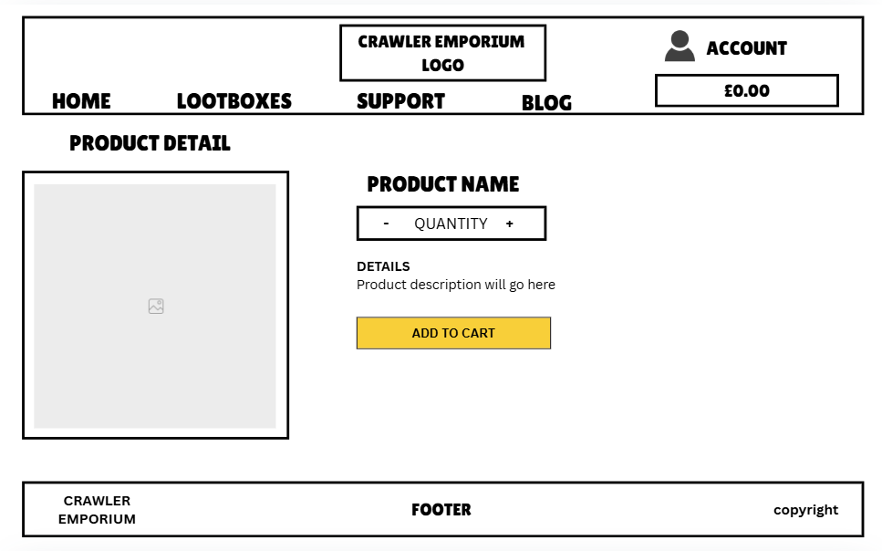</td>
    <td>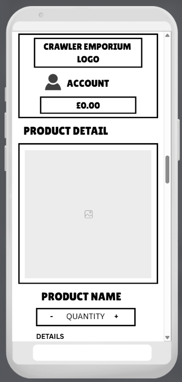</td>
  </tr>
</table>

#### The Checkout
This wireframe covers the view of the checkout. The idea is to make it as clear and easy for the user to view the items they are going to buy, fill in their details, and enter their card details. 
<table border="0">
  <tr>
    <td>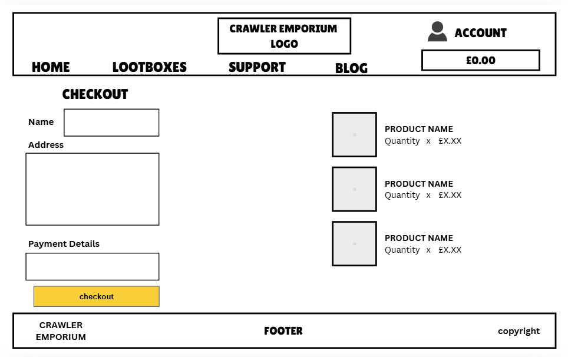</td>
    <td>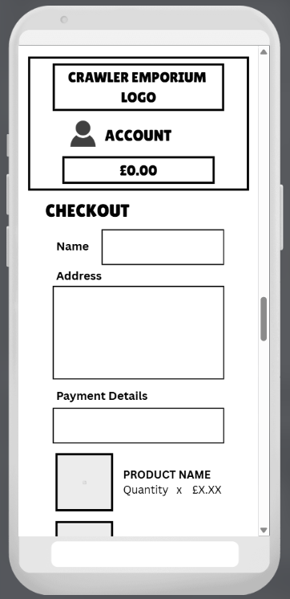</td>
  </tr>
</table>

#### The Support / Tickets
This wireframe covers the view of the support pages. The idea is that the user can see everything in one place. There will be a form on the left hand side for users to submit queries, followed by a series of FAQ on the right. This will stack vertically on mobile view. 
<table border="0">
  <tr>
    <td>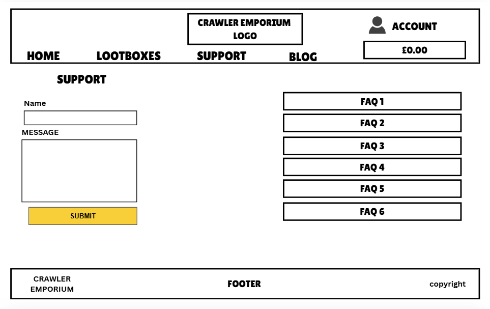</td>
    <td>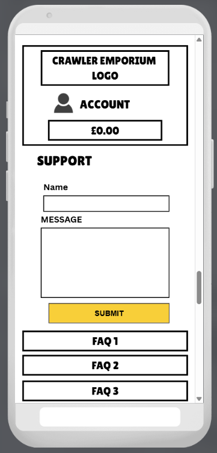</td>
  </tr>
</table>

#### Credential Pages
This wireframe covers the view of the credentials pages. Whenever a user is asked to enter credentials, or confirm something. They are presented with a centralised view of the login fields with the rest of the screen completely empty. 
<table border="0">
  <tr>
    <td>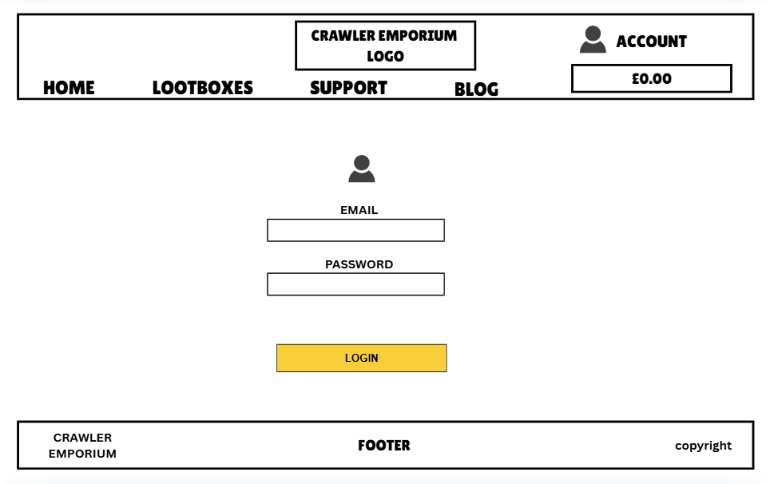</td>
    <td>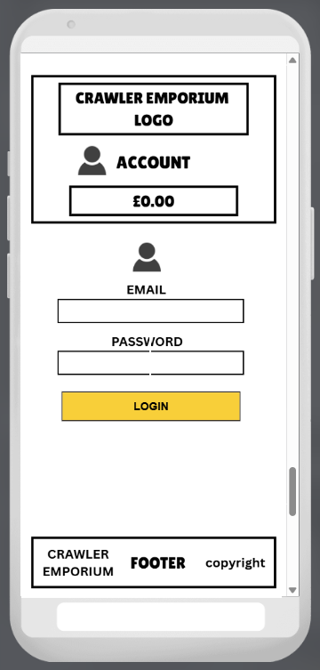</td>
  </tr>
</table>

#### Account / Profile Pages
This wireframe covers the view of the user account. The idea is that the user can view/update their information and see their order history all from the same place. 
<table border="0">
  <tr>
    <td>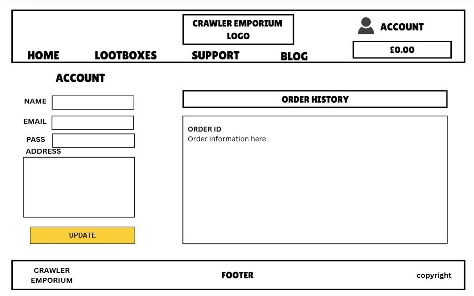</td>
    <td>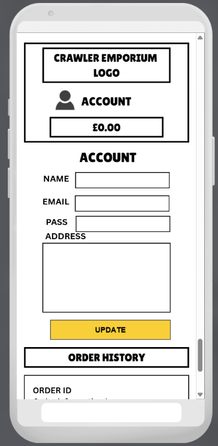</td>
  </tr>
</table>
---

## Features

### Core Application Features
* **System Log :** A live Javascript system log ticker running timing patterns to simulate machine achievement notifications on page load. The idea of this was to simulate the view you get in a game whereby other players actions appear on your screen. It is also similar to other e-commerce websites whereby a toast will appear to display what other users have purchased. The ticker works by choosing from 3 different lists. 1. A list of user_ids, 2. A list of achievements, 3. A list of activities. After each timing gap it will randomly display a new combination of the three.
    <br>
    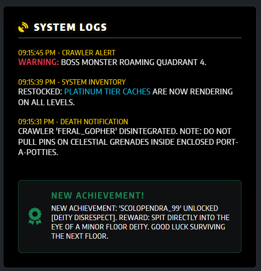
    <br>


* **Flickity Inventory Carousel:** I decided to include a carousel using Flickity - A Javascript enabled carousel. It is touch enabled for mobiles and will allow users to add products to their cart seamlessly directly from the carousel, or click on the product image to load the product detail.
    <br>
    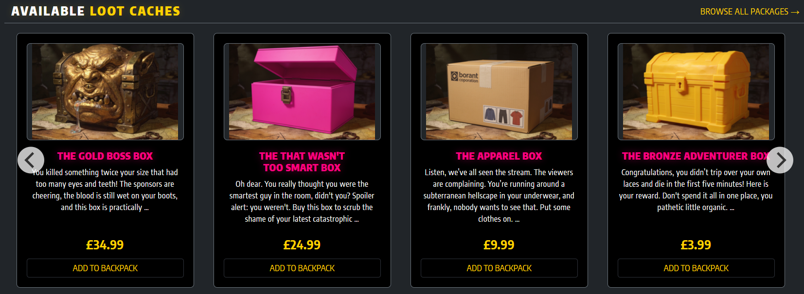
    <br>


* **Support Desk Tickets:** A ticket dashboard where both guests and registered accounts can log tickets. Upon submission, a Django view automatically generates a new ticket in the table and assigns a string token to the ID (e.g., `TICK#0045`), it will then automatically send a plaintext summary back to the user's email.
  <table border="0">
    <tr>
      <td>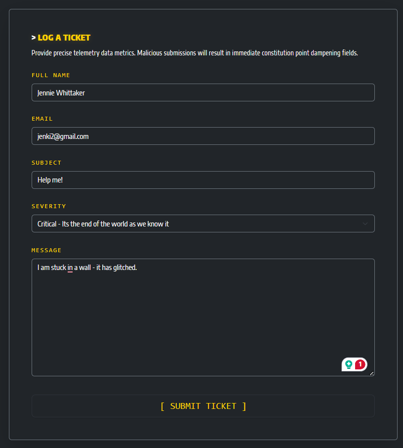</td>
      <td>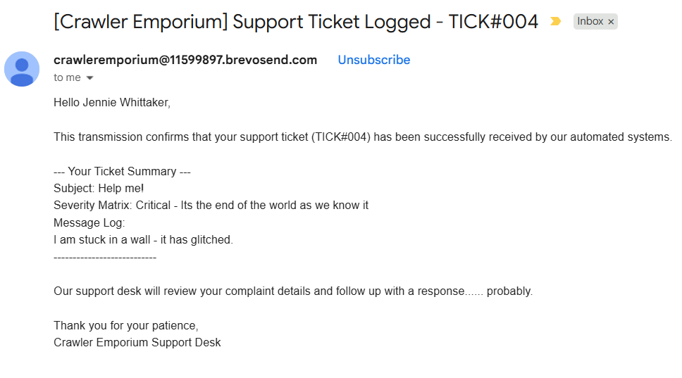</td>
    </tr>
  </table>

* **'AI' Toasts:** Custom success notifications that pop up dynamically to alert users when items are added to their backpack, support tickets are raised and on profile account triggers. 
  <table border="0">
    <tr>
      <td>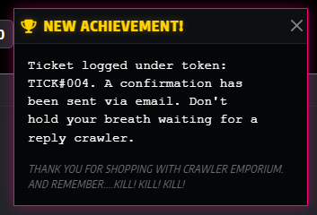</td>
      <td>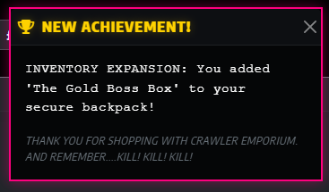</td>
    </tr>
  </table>


### Future Implementations
While the platform successfully satisfies all primary requirements for Milestone 4, the following ideas are scheduled for future deployments of the project. 

* **Admin Frontend CRUD:** At the moment all of the administrative CRUD tasks happen inside of Djangos native admin dashboard. I would like to move database management parameters (product tracking, support tickets, and blog posts) into a custom frontend console wrapper protected by server-side `@user_passes_test`.
<br>

* **Live System Log:** At the moment the System log on the index page relies on a random selection of users / achievements. I would like to use realtime order data, and account data to provide the data for the system log ticker. 
<br>

* **Order Tracking:** At the moment, users can only see orders placed. There is no facility to edit the order or receive any order status / tracking updates. I would like to integrate a full order tracking interface to provide this level of detail. 
<br>


### Defensive Design

To guarantee application stability, database integrity, and a continuous user experience, defensive programming principles were enforced across both the frontend layout and backend architecture.

#### 1. Custom System Intercepts (404 & 500 Error Modules)
* **The Safeguard:** If a user navigates to a URL that doesn't exist, or a server exception is triggered, the system intercepts the break using custom-routed templates (`404.html` and `500.html`) instead of crashing to standard browser diagnostic screens.
* **In-Universe Continuity:** To match the site aesthetic, these pages feature a clear, stylised error message alongside a highly visible **[Return to Safezone]** and **[Browse Available Loot]** navigation buttons, ensuring the user is never stranded and can seamlessly re-enter the main storefront loop.
    <br>
    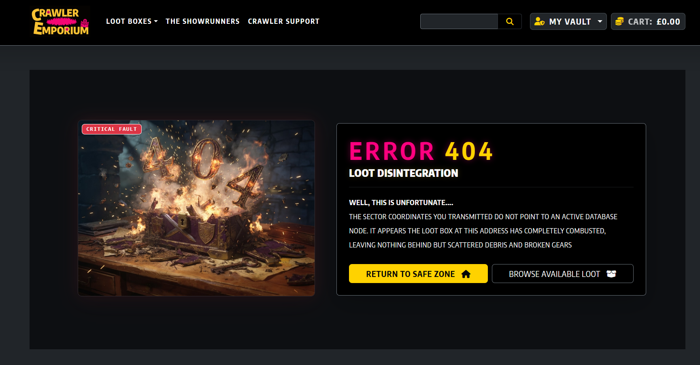
    <br>


#### 2. Role-Based View Protection (Native Django Admin Guardrails)
* **The Safeguard:** Access to the platform's inventory backend, support log databases, and blog dashboard is centralised and guarded via Django's built-in administration path (`/admin`).
* **Defensive Action:** Server-side checks actively prevent unauthorised or standard user profiles from viewing, accessing, or manipulating database tables. If an unauthenticated user or non-staff account attempts to access or force-type administrative URL paths, Django’s native authentication blocks execution instantly and forces a redirect back to admin login gateway.
    <br>
    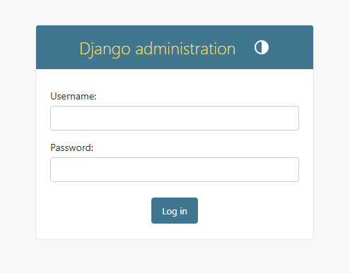
    <br>

#### 3. Secure Form & Data Input Validation
* **The Safeguard:** All interactive client-side entry fields are validated using a defensive approach:
  * **Frontend Verification:** Built-in HTML5 attributes (`required`, `min`, `max`, `type="number"`) restrict user inputs right at the interface stage preventing characters in numeric boxes or quantities out of bounds inside the active shopping Backpack.
  * **Backend Verification:** To protect against attacks such as SQL injection, Django’s native form validation processing pipeline (`form.is_valid()`) checks all incoming tokens before saving them to the live PostgreSQL database. If data is corrupted/incorrect, the form securely reloads with error tooltips at the affected fields explaining to the user what they need to do.
    <br>
    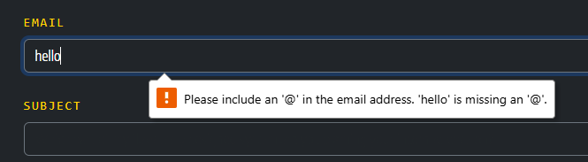
    <br>

#### 4. Transaction Verification & Stripe
* **The Safeguard:** The application uses backend Stripe element webhooks to process payments. If a user loses internet connectivity or closes their browser tab mid-transaction, the server-side webhook catches the confirmation direct from Stripe and builds the order entry in the database anyway. This prevents "ghost charges" where a customer is billed but their purchase log fails to save.

### Accessibility
* **Semantic HTML structures:** HTML built using semantic structural tags (`<main>`, `<header>`, `<footer>`, `<section>`).
* **Interactive Focus Tracking:** Focus boundaries (`:focus`) are used to create high-contrast glow markers around input loops and dropdown selectors for keyboard users.
* **Descriptive Metadata:** Images use `alt` tags to provde comprehension to screen reader technologies.
* **ARIA Assistive Technology:** Interactive elements have been given `aria-label` attributes to ensure screen readers can clearly announce their purpose to those using assistive technologies, keyboard navigation and screen readers. 

---

## Database Architecture

The application implements a relational layout structure powered by a live PostgreSQL database. The ERD was created using [DBDiagram.io](https://dbdiagram.io/).

<strong>A copy of the ERD can be viewed [here](https://dbdiagram.io/d/MS4-6a52a4374ac62e474c841bb5) </strong><br>
The image below shows the relationships between the different apps. The Django auth_user is the table that drives the linking relationships between the other tables. I have grouped and labelled the tables in relation to their relevant app

  <table border="0">
    <tr>
      <td>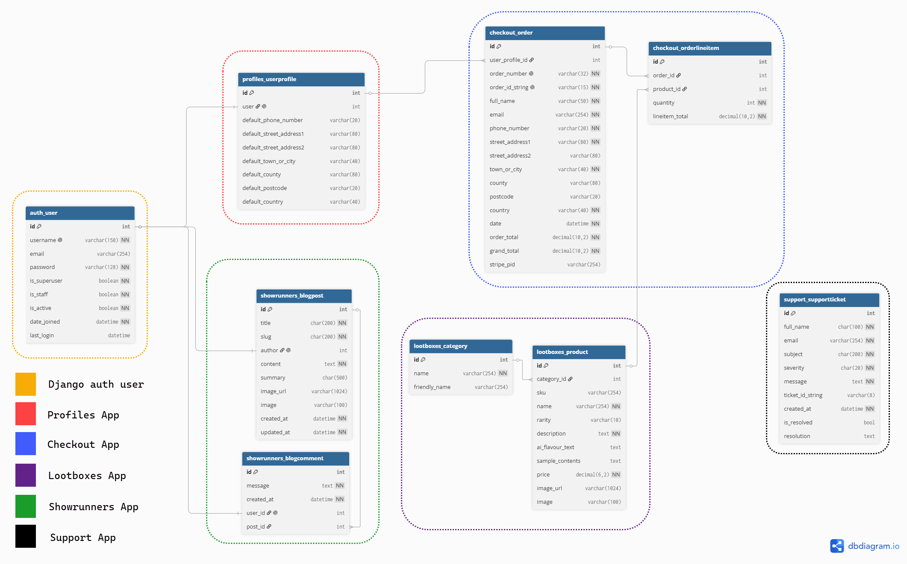</td>
    </tr>
    <tr>
      <td>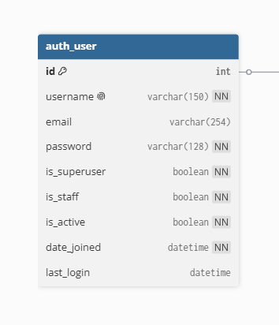</td>
      <td>The image shows the Django auth_user table</td>
    </tr>
    <tr>
      <td>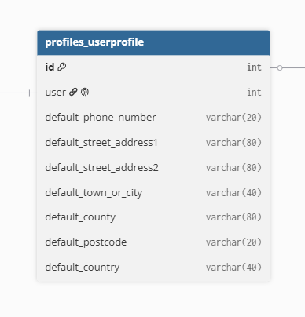</td>
      <td>The image above the Profiles App table</td>
    </tr>
    <tr>
      <td>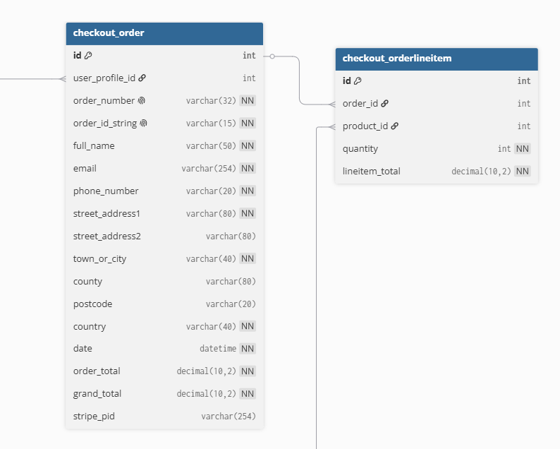</td>
      <td>The image shows the Checkout App table</td>
    </tr>
    <tr>
      <td>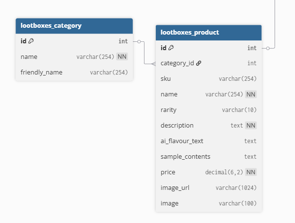</td>
      <td>The image shows the Lootboxes App table</td>
    </tr>
    <tr>
      <td>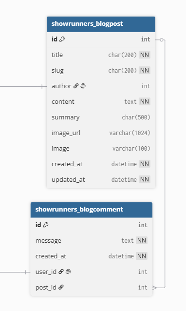</td>
      <td>The image shows the Showrunners App table</td>
    <tr>
      <td>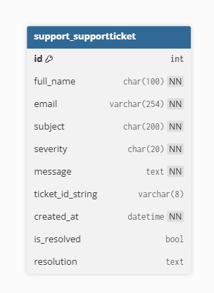</td>
      <td>The image shows the Support App table</strong></td>
    </tr>
  </table>


## Technologies Used

* **Languages:** HTML5, CSS3, Python
* **Frameworks:** Django, Bootstrap 5
* **Database:** PostgreSQL
* **Hosting:** [Railway](https://www.railway.com)


### Tools & Libraries Used

**Development Environments & Version Control**
* [VS Code](https://code.visualstudio.com/) - IDE used to create the site.
* [Git](https://git-scm.com/) - For version control.
* [Github](https://github.com/) - To save and store the files for the website.
* [Pip](https://pypi.org/project/pip/) - Tool for installing Python packages.

**External APIs & E-Commerce Integrations**
* [Stripe Engine API](https://stripe.com/) - Used to handle secure credit card verification, processing payment authentication.
* [Brevo Cloud Mail Server](https://www.brevo.com/) - External cloud email service platform used to manage and distribute automated text emails to users via an API key handshake.

**Python Packages & Libraries**
* [Django Allauth](https://docs.allauth.org/en/latest/installation/quickstart.html) - Open source Django package that provides a complete, ready to use authentication and registration system.
* [WhiteNoise](https://whitenoise.readthedocs.io/en/stable/django.html) - Allows the Django web application to serve its own static files (CSS/JavaScript/Images) directly in production.
* [Psycopg2-binary](https://pypi.org/project/psycopg2-binary/) - Allows the Django application to connect and communicate with PostgreSQL databases.
* [Django Anymail](https://anymail.dev/en/stable/) - Integrates the Django mailing layer with Brevo via a secure HTTP API connection.
* [Django Crispy Forms](https://django-crispy-forms.readthedocs.io/en/latest/) - Used to control and render clean, responsive Bootstrap 5 input structures directly within Django template loops.
* [Pillow](https://pillow.readthedocs.io/en/stable/) - A Python imaging library used to handle processing verification checks on database model image file fields.

**Frontend Packages & Libraries**
* [Flickity](https://flickity.metafizzy.co/) - A responsive, touch-enabled JavaScript library used to build the responsive lootbox carousel slider on the homepage.

**Design, Assets & Wireframing**
* [Canva](https://www.canva.com/online-whiteboard/wireframes/) - Used to create wireframes.
* [Photopea](https://www.photopea.com/) - Used to edit and create graphics for the project.
* [To WebP](https://towebp.io/) - Used to convert images to WebP format.
* [Real Favicon Generator](https://realfavicongenerator.net/) - Used to create the favicon based on the logo.
* [Google Fonts](https://fonts.google.com/) - Google fonts were used for typography across the project.
* [PostImages](https://postimg.cc/) - Used to host the product images on production server.

**Database Planning**
* [dbdiagram.io](https://dbdiagram.io/) - Used to create the Entity Relationship Diagrams.


## Deployment & Local Development

### Production Deployment to Railway
The live application is deployed inside on **Railway**, attached to a live **PostgreSQL** relational database. 

#### Phase 1: Environment Configuration Files
Before initiating deployment, two configuration files must exist at the root level of your repository to instruct Railway's build container how to execute your Django application:

1. **`requirements.txt`**: Tells the server which Python modules to install. Generate this by running:
   ```bash
   pip3 freeze > requirements.txt
   ```

2. **`runtime.txt`**: Declares the exact Python version to prevent mismatches would there to be future updates (Python 3.14.5).

#### Phase 2: Railway Infrastructure Setup

1. Log into your Railway Dashboard and click New Project ➡️ Deploy from GitHub repository.

2. Select your repository, in this example CI-MS4-CrawlerEmporium.

3. On your project canvas view, click **+ Add** and select Database ➡️ Add PostgreSQL. This automatically provisions a live SQL database.

4. Navigate to your application service container's Variables tab and inject the following production environment variables:

      **SECRET_KEY:** Your unique Django secret key from your application.

      **DATABASE_URL:** This is generated when you create the PostgreSQL database within Railway. By declaring this variable you map the the association between the Railway app and the PostgreSQL database.

      **STRIPE_PUBLIC_KEY:** Once you create your Stripe account, navigate to your sandbox account and The publishable developer key retrieved from your Stripe dashboard.

      **STRIPE_SECRET_KEY:** This is the private API key that is used to process transaction handshakes on the backend.

      **STRIPE_WH_SECRET:** This is a digital authentication key that verifies real-time payment confirmation messages sent directly from Stripe to the Django database.

      <br>
      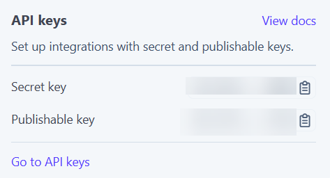
      <br>


      **BREVO_API_KEY:** The key required to authenticate the Anymail HTTP transmission in order to send emails. 

5. Go to your application service Settings panel ➡️ Deploy and then find the Custom Start Command input box, and insert the deployment script to ensure all assets are correctly migrated when the project deploys from.

    <br>
    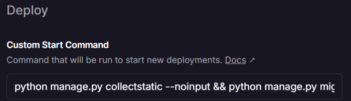
    <br>
    <br>

   ```bash
   python manage.py collectstatic --noinput && gunicorn <<your_project_name>>.wsgi
   ```


#### Phase 3: Database Initialisation
Once Railway has successfully deployed the project, the linked PostgreSQL database tables need to be built and populated.

1. From the application container ➡️ Click on Console. 
  <br>
  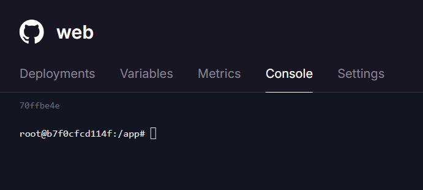
  <br>

2. Execute the following command to migrate the model architecture onto the PostgreSQL database. 

    ```bash
    python manage.py migrate
    ```

3. Execute the following command to create an administrative user in order to perform admin tasks. Follow the prompts to create the username and password. 

    ```bash
    python manage.py createsuperuser
    ```

4. The categories and product data is held in 2 JSON files. The following commands will take those JSON files and populate the relevant tables. 

    ```bash
    python manage.py loaddata categories.json
    python manage.py loaddata products.json
    ```


### Forking the GitHub Repository

By forking the GitHub Repository we make a copy of the original repository on our GitHub account to view and/or make changes without affecting the original repository by using the following steps...

1. Log in to GitHub and locate the [GitHub Repository](https://github.com/)
2. At the top of the Repository (not top of page) just above the "Settings" Button on the menu, locate the "Fork" Button.
3. You should now have a copy of the original repository in your GitHub account.

### Cloning the GitHub Repository

By cloning the Github Repository we make a copy of the original repository on a local computer allowing you to interact with files directly in an editor, such as VS Code. 

1. On GitHub, navigate to your fork of the repository.
2. Click the green **Code** button located above the file directory.
3. Copy the URL string provided (HTTPS or SSH alternative).
4. Open your local machine's terminal window, navigate to where you want the project to live, and enter the following git command:
   ```bash
   git clone [https://github.com/MrsG33k/CI-MS4-CrawlerEmporium.git](https://github.com/MrsG33k/CI-MS4-CrawlerEmporium.git)
   ```

5. Navigate into the newly created folder
   ```bash
   cd CI-MS4-CrawlerEmporium
   ```
6. Intitialise your Python Virtual Environment layer (.venv) and run the setup parameters locally:
   ```bash
    python3 -m venv .venv
    source .venv/bin/activate
    pip3 install -r requirements.txt
    python3 manage.py migrate
    python3 manage.py runserver
    ```

## Testing
Please refer to [TESTING.md](TESTING.md) file for all testing carried out.

## Credits

- [Django Framework documentation](https://docs.djangoproject.com/en/6.0/ref/templates/builtins/#linebreaksbr): Used when trying to implement a line break in the sample contents of the lootboxes.
- **Remove  from Backpack / Update backpack functionality** - The logic in `backpack/views.py` and the JS in `backpack.html` were built in collaboration with an Michael Whittaker within VS Code. This been noted in the code comments itself too.
- [Code With Bubb](https://www.youtube.com/watch?v=A8yfwdET-2E): Used to help with the Javascript timings updating ticker on the index.html page
- [W3 Schools JS](https://www.w3schools.com/js/js_timing.asp): Used in conjunction with the above to help when creating the Javascript ticker to simulate a system log. 
- **The Tagsoc Bookclub** - They group, including Chris, Hekla, Kim and Tim helped with producing the loot box names and descriptions, the AI toasts, the System Log achievements, and the content for the blog and FAQs. 


### Acknowledgments

* **Michael Whittaker:** For providing technical troubleshooting assistance during the initial deployment phase to Railway, and for thorough cross-device compatibility testing to ensure a seamless responsive user experience.
* **Rachel Furlong:** EKC tutor - She offered some really helpful advice on how to tackle this and helped with breaking down the project especially once the timeframes for submitting the project were restricted.

### Complications
**EKC College - Ashford:** In April, the college decided to end their partnership with Code Institute. I was working to a timeline to finish this milestone Project in October. These timeframes were suddenly severely restricted with the college insisting all work be submitted by 30th June. This has limited my creativity and time to really work on developing my coding skills in order to hit the higher criteria in the assessment grid.  