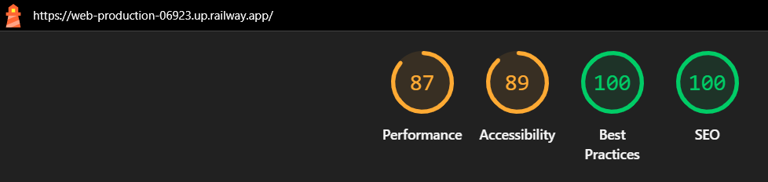
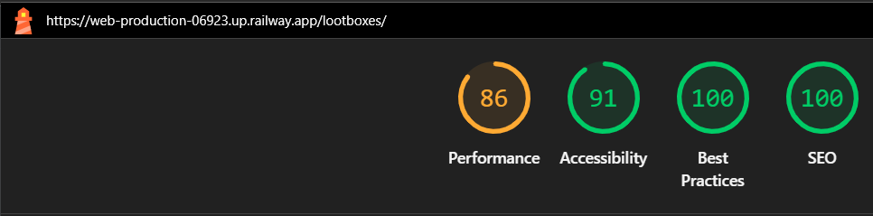
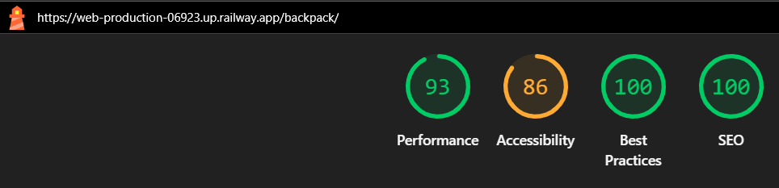
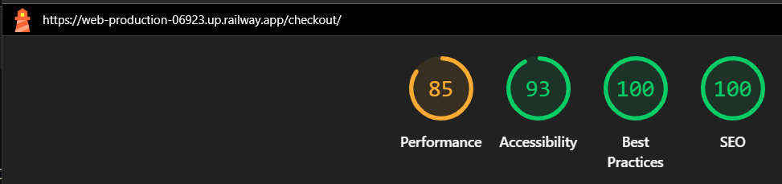
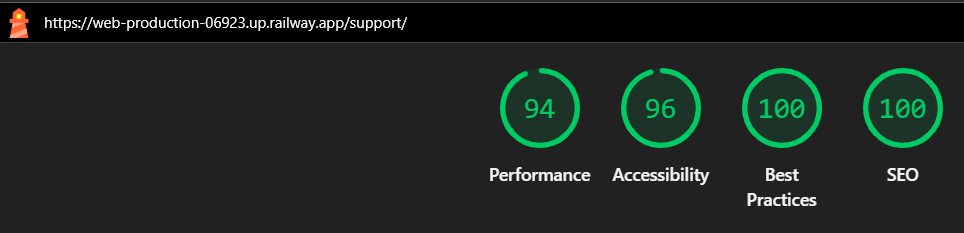

# Crawler Emporium - System Diagnostic & Testing Log

<figure>
    
</figure>

# Testing Strategy & Verification Rationale

Testing was ongoing throughout the entire build. I utilised Chrome developer tools whilst building to pinpoint and troubleshoot any issues as I went along. The documentation below records the  manual and automated testing, accessibility compliance, and validation logs conducted across the Crawler Emporium application.

### Automated vs. Manual Testing: Conceptual Overview

* **Automated Testing:** Utilises programmatic test scripts to systematically execute code paths and validate database models. While efficient for large-scale, repetitive data tracking, automated scripts are rigid and blind to user experience fluidity, visual layout bugs, and human interaction nuances.
* **Manual Testing:** Relies on a human operator interacting directly with the frontend browser layout user interface (UI) to systematically execute user journeys, verify responsive layout breakpoints, and test real-time visual feedback like dynamic alerts and system toasts.

### Selection Rationale: Why Manual Testing Was Chosen

For the validation of this platform, a deliberate **comprehensive manual testing strategy** was chosen as the optimal approach for the following core engineering reasons:

1. **Immersive UI & Animation Timing:** Because this platform heavily relies on highly visual, dynamic, and timing-dependent interactive elements—such as the real-time JavaScript system log ticker, dynamic Flickity carousels, and custom 'AI' achievement toasts, human manual testing is the only way to genuinely verify that these features look right, and time out correctly for a user.
2. **End-to-End Defensive Verification:** Manual testing allowed for true "black box" security testing. By logging out completely and manually force-typing protected administrative URL paths (like `/profile/settings/` or product creation views) into the browser address bar, it was possible to visually confirm that the  redirection and `@login_required` barriers catch unauthorised traffic flawlessly and handle them in real time.
3. **Cross-Device Accessibility:** Software testing scripts cannot replicate how a site feels on a mobile screen. Meticulous manual testing across various desktop, tablet, and mobile viewports was vital to guarantee that the application's complex responsive grid scaling, touch gestures, and focus outlines remain pristine and accessible.

By prioritising an exhaustive, user-centric manual verification, the application ensures that both the strict underlying backend security guardrails and the overall frontend user experience are robust and functional.

---

## 1. Validation Testing

### Code Validation (HTML, CSS, JavaScript, Python)
All source code files were run through syntax checkers to confirm structural integrity and PEP8  compliance.

* **HTML Validation:** Checked using the [W3C Markup Validation Service](https://validator.w3.org/). 
* **CSS Layout Validation:** Checked using the [W3C CSS Validation Jigsaw Service](https://jigsaw.w3.org/css-validator/).
* **JavaScript Validation:** Checked using [JSHint](https://jshint.com/).
* **Python Compliance:** Checked using the [Flake8](https://flake8.pycqa.org/en/latest/).

### HTML & Layout Templates
HTML validation was carried out by copying the URL from the live production environment for the relevant pages and running it through the [W3C Nu HTML Validator](https://validator.w3.org/#validate_by_input). One fix that was carried out across the pages was removing the `<h>` tag and replacing it with `
` tags. This was because the styling was being completely handled by the CSS and so the heading tags were irrelevant. 

| Pages | Link Stem | Validation Status | Screenshot Evidence |
| :--- | :--- | :---: | :--- |
| **Home Page** (Homepage) | [The Crawler Emporium](https://web-production-06923.up.railway.app/) | **PASS** | [View W3C Confirmation](documentation/html-home.webp) |
| **Loot Boxes** (Inventory Feed) | [/lootboxes/](https://web-production-06923.up.railway.app/lootboxes/) | **PASS** | [View W3C Confirmation](documentation/html-lootbox.webp) |
| **Lootbox Product detail** (Product View) | [/lootboxes/detail/](https://web-production-06923.up.railway.app/lootboxes/2) | **PASS** | [View W3C Confirmation](documentation/html-lootboxdetail.webp) |
| **Backpack** (Backpack View) | [/backpack/](https://web-production-06923.up.railway.app/backpack/) | **PASS** | [View W3C Confirmation](documentation/html-backpack.webp) |
| **Crawler Support** (Support Center) | [/support/](https://web-production-06923.up.railway.app/support/) | **PASS** | [View W3C Confirmation](documentation/html-support.webp) |
| **The Showrunners** (Showrunners Blog) | [/showrunners/](https://web-production-06923.up.railway.app/showrunners/) | **PASS** | [View W3C Confirmation](documentation/html-blog.webp) |

---

### Python (PEP8 Compliance)
[Flake8](https://flake8.pycqa.org/en/latest/) was used for checking the compliance of the .py files across the multiple app against the PEP8 guidelines. As part of this testing I utilised the `# noqa: E501` on some lines as it was not possible to split the string across multiple lines. `# noqa: F401` was also used on crawleremporium/settings.py to denote that .env was imported but not used. This has been kept in as a toggle so that I could work between the development and the production servers when developing and deploying the project. All other tests passed. Details of the files tested are below: 

| System App  | Core Files Tested | Compliance Status |
| :--- | :--- | :---: |
| **`crawleremporium`** | `settings.py`, `urls.py` | **PASS** |
| **`home`** | `apps.py`, `urls.py`,`views.py` | **PASS** |
| **`lootboxes`** | `models.py`, `urls.py` `views.py` | **PASS** |
| **`backpack`** | `contexts.py` `urls.py`, `views.py` | **PASS** |
| **`checkout`** |`admin.py`, `forms.py`, `models.py`, `signals.py`, `urls.py`, `views.py`, `webhook_handler.py`, `webhooks.py` | **PASS** |
| **`support`** | `models.py`, `views.py`, `forms.py` | **PASS** |
| **`showrunners`** | `forms.py`, `models.py`, `views.py`, `forms.py` | **PASS** |

---

### CSS Styles & Javascript Validation
* **CSS Validation:** The styling `base.css` was validated using the [W3C CSS Validation Jigsaw Service](https://jigsaw.w3.org/css-validator/). | 
        

            
        

* **JavaScript Validation:** The system log ticker was validated using [JSHint](https://jshint.com/).

| Javascript Section | Validator | Status | Evidence|
| :--- | :--- | :---: | :--- |
| System Log Ticker | JSHint | **PASS** | [View Evidence](documentation/systemlog-jshint.webp) |
| Stripe Elements| JSHint | **PASS** | [View Evidence](documentation/stripe-jshint.webp) |
| Remove from Backpack| JSHint | **PASS** | [View Evidence](documentation/backpack-jshint.webp) |

---

## Performance and Accessibility Validation

Google Lighthouse via Chrome DevTools was used to test the application's performance, accessibility, adherence to best practices, and search engine optimization (SEO). 

### Lighthouse Scoring Summary

---

#### 1. Home Page (Desktop)
* **Results:** 
    
* **Findings:**
    * Performance (87/100): Minor loading delays are caused by render-blocking scripts (like Bootstrap and Google Fonts) and uncompressed catalog imagery that totals roughly 1 MB of extra payload. It also flags a lack of long-term browser caching for static assets.

    * Accessibility (89/100): Highly compliant with semantic structure and ARIA labels, with minor point deductions due to color contrast thresholds where vivid theme text sits against the deep onyx background.

    * Best Practices (100/100) & SEO (100/100): The homepage scored perfectly, confirming excellent security standards, valid code architecture, and optimised search engine discoverability.

#### 2. Lootboxes (Desktop)
* **Results:** 
    
* **Findings:**
    * Performance (86/100): Loading speed is mainly impacted by unoptimised media assets, with image delivery improvements offering an estimated savings of 2.2 MB. Minor overhead is also caused by render-blocking layout scripts and stylesheets, missing cache policies on static elements, and third-party (Google) font loading latency.

    * Accessibility (91/100): Excellent structure, form navigation, and clear ARIA identifiers across the inventory components, with minor point adjustments stemming from strict neon-on-black color contrast thresholds.

    * Best Practices (100/100) & SEO (100/100): The lootboxes scored perfectly, confirming excellent security standards, valid code architecture, and optimised search engine discoverability.

#### 3. Backpack (Desktop)
* **Results:** 
    
* **Findings:**
    * Performance (93/100): Excellent core loading metrics, with minor overhead flagged for render-blocking static style/script configurations, standard caching policies, and font load handling.

    * Accessibility (86/100): Strong overall compliance, with points deducted due to contrast warnings where text styles do not meet sufficient background contrast ratios against the theme palette.

    * Best Practices (100/100) & SEO (100/100): Achieved perfect maximum marks, validating full browser security compliance and ideal crawlability standards.

#### 4. Checkout (Desktop)
* **Results:** 
    
* **Findings:**
    * Performance (85/100): Initial loading speeds are affected by standard render-blocking scripts and stylesheets, alongside minor image delivery and font display delays. The score also reflects lack of long-term caching headers and minor browser rendering loops (forced reflow) common with processing Stripe scripts.

    * Accessibility (93/100): Strong overall structural layout with reliable keyboard navigation and clear form parameters for checkout entries, with minor deductions tied to high-contrast palette compliance checks.

    * Best Practices (100/100) & SEO (100/100): Achieved a perfect full rating, ensuring entirely secure data submission pipelines, solid secure connection practices.

#### 4. Support (Desktop)
* **Results:** 
    
* **Findings:**
    * Performance (94/100): Only minor optimisations noted for standard render-blocking scripts, leverage of static cache lifetimes, font display properties, and minimal image compression adjustments.

    * Accessibility (96/100): Near-perfect execution, demonstrating excellent input labeling, semantic structures, and layout predictability across the support form elements.

    * Best Practices (100/100) & SEO (100/100): Earned full marks across both criteria, validating absolute code compliance, script safety, and maximum engine discoverability.

#### 5. Showrunners (Desktop)
* **Results:** 
    
* **Findings:**
    * Performance (86/100): Loading optimisation opportunities are standard, with small latencies attributed to initial render-blocking requests, missing static cache policies, and minor font display rendering overhead.

    * Accessibility (91/100): olid interface accessibility score, proving reliable article structure and navigable comment areas, with minor deductions tied to high-contrast theme thresholds.

    * Best Practices (100/100) & SEO (100/100):Earned full marks across both criteria, validating absolute code compliance, script safety, and maximum engine discoverability.

---

## 3. Manual Feature & User Story Matrix

Every core interactive element was manually validated across multiple viewports (Desktop, Tablet, Mobile) and cross-checked against our foundational UX criteria.

### Manual Features

#### Navigation Bar & Global Elements (All Pages)

| Feature / Action | Expected Operational Outcome | Testing Steps Executed | Result Status |
| :--- | :--- | :--- | :---: |
| **Responsive Hamburger Menu** | Collapses into a toggle icon on mobile viewports; expands fluidly without shifting layout items. | Scaled browser window down to mobile width; tapped icon to verify overlay. | **PASS** |
| **Authentication Link Logic** | Anonymous traffic sees 'Register' / 'Login'. Authenticated crawlers see 'Vault Management', 'Profile' and 'Logout'.| Toggled login states; verified navigation dropdown updates accurately in real time. | **PASS** |
| **Admin Authorisation** | The frontend link `> + Add new lootbox` renders **only** if the account possesses superuser status. | Logged in as a standard crawler recruit, then an administrator; verified the option visibility. | **PASS** |
| **Real-time Backpack Total** | Backpack price indicator updates its balance instantly upon cart additions or deletions. | Added multiple boxes to the backpack; verified navigation subtotal increments perfectly. | **PASS** |

---

#### Home Page & System Log (`home` App)

| Feature / Action | Expected Operational Outcome | Testing Steps Executed | Result Status |
| :--- | :--- | :--- | :---: |
| **JavaScript Ticker Execution** | Ticker randomly compiles user IDs, achievements, and activities, shifting entries at timed intervals smoothly. | Observed the home banner readout for 2 minutes across multiple device loads to track rotation loops. | **PASS** |
| **Flickity Touch Carousel** | Renders across all viewport sizes; handles horizontal swiping inputs on mobile devices. | Tested swipe gestures on Samsung Galaxy and iPhone viewports; verified zero overflow. | **PASS** |
| **Carousel Quick-Add Buttons** | Pressing the 'Add to Backpack' purchase link increments the cart without requiring the detailed lootbox page to load. | Clicked 'Add to Backpack' option on the slider; confirmed the 'AI' toast confirmed successfully added to backpack. | **PASS** |

---

#### Lootbox Catalogue & Detail Views (`lootboxes` App)

| Feature / Action | Expected Operational Outcome | Testing Steps Executed | Result Status |
| :--- | :--- | :--- | :---: |
| **Catalogue Sort Selectors** | Re-orders the display grid dynamically by ascending/descending price and alphanumeric titles. | Toggled sorting configurations; confirmed product blocks realigned according to database prices. | **PASS** |
| **Category Quick Filters** | Isolates inventory grid items to match the targeted category choice string accurately. | Clicked navigation category entries; verified that non-matching lootboxes were hidden from view. | **PASS** |
| **Detail Page Content Splits** | Descriptions render multi-line text blocks and clean string representations without formatting text breaks. | Loaded individual lootbox details; checked that the sample contents split with proper line breaks. | **PASS** |
| **Quantity Threshold Gates** | Built-in form parameters block negative inputs or numbers that exceed the inventory cap of 3. | Attempted to manually type `-5` and `100` into the input selector box; form rejected the action. | **PASS** |

---

#### The Shopping Backpack (`backpack` App)

| Feature / Action | Expected Operational Outcome | Testing Steps Executed | Result Status |
| :--- | :--- | :--- | :---: |
| **Quantity Modification Links** | Clicking 'Update' adjusts subtotal values and alters individual inventory total price accurately. | Shifted line item quantity parameters; clicked update link and checked calculated row price. | **PASS** |
| **Line Item Deletion** | Tapping the 'Remove' button deletes the row entirely, shifting layout items up cleanly. | Clicked remove, confirmed item row removed and the total cost updated. | **PASS** |
| **Empty State** | If the backpack is empty, a system message shows up alongside a link pointing back to the lootbox page. | Removed all active items from the backpack; confirmed empty cart notification displays. | **PASS** |

---

#### Checkout (`checkout` App)

| Feature / Action | Expected Operational Outcome | Testing Steps Executed | Result Status |
| :--- | :--- | :--- | :---: |
| **Form Data Validation** | Flags to the user if required billing inputs or email symbols are incomplete. | Left required street details blank and skipped email fields; validated form blocked submission. | **PASS** |
| **Stripe Element Integration** | Secure card box captures inputs, tracks format errors in real time, and executes payment processing securely. | Input test card details (4242 4242 4242 4242 01/30 123); confirmation of successful purchase. Checked the transaction via the Stripe dashboard for confirmation. | **PASS** |
| **Post-Purchase Invoicing** | Order success page generates an order number, detailed row values, and saves shipping data. | Completed a test checkout run; confirmed success terminal page outputs correct details. Email was also sent confirming this | **PASS** |
| **Stripe Webhook** | Orders are securely written to the database via background webhooks even if web connection drops mid session. | Emulated a broken transaction using Stripe CLI intercepts; verified database entry recorded. | **PASS** |

---

#### Support (`support` App)

| Feature / Action | Expected Operational Outcome | Testing Steps Executed | Result Status |
| :--- | :--- | :--- | :---: |
| **Ticket Log Processing** | Form submissions generate a ticket row inside the database, attaching a formatted ID (e.g., `TICK#0045`). | Logged test tickets as both anonymous guest and as a crawler profile; verified submission entries | **PASS** |
| **Brevo Cloud Automation** | Submitting a ticket generates an automated plain-text message summary to the user's email address. | Submitted form using a live verification email account; confirmed receipt of Brevo routing message. | **PASS** |
| **Accordion FAQ Toggles** | Tapping FAQ headers rolls out the answers smoothly, adjusting surrounding structural content cleanly. | Exercised accordion questions across desktop, mobile and tablet setups to check component responsiveness. | **PASS** |

---

#### Showrunners Blog(`showrunners` App)

| Feature / Action | Expected Operational Outcome | Testing Steps Executed | Result Status |
| :--- | :--- | :--- | :---: |
| **Comment Thread Submission** | Only authenticated crawlers can write comments beneath entries; input text clears out cleanly upon submission. | Logged in as regular user, drafted a reply, and submitted; verified entry appends to post immediately. | **PASS** |
| **Comment anonymously** | Anonymous traffic can read posted articles but cannot view, click, or write inside the comment submission container. | Visited article page as anonymous visitor; confirmed text form box is completely hidden from view. | **PASS** |

---

#### Administrative Frontend Operations (CRUD Validation)

| Feature / Action | Expected Operational Outcome | Testing Steps Executed | Result Status |
| :--- | :--- | :--- | :---: |
| **Bespoke Product Creation Form** | Superusers can create new products. | Loaded 'Add product' view; verified form headers read as clean text; completed the form and clicked Submit. Verified product appeared instantly in lootboxes view. | **PASS** |
| **Live Product Updates** | Tapping 'Edit Lootbox' on a product detail page loads the entry view with existing fields pre-filled. | Clicked edit button as admin; changed prices and checked that alterations saved on submit. | **PASS** |
| **Product deletion** | Tapping 'Delete Lootbox' triggers a warning box; confirming removes the record from the database. | Clicked delete on test item; clicked 'OK' on prompt; verified item vanished from main grid feed. | **PASS** |
| **Security Overrides** | Standard users trying to access administrative URLs directly are blocked and redirected. | Pasted product modification URLs directly into the browser tab as a standard user; verified route blocked. | **PASS** |

### User Story Verification

| I want to be able to... | So that I can... | How is this achieved? | Status |
| :--- | :--- | :--- | :---: |
| **FIRST TIME VISITORS ("CRAWLERS")** | | | |
| I want to instantly understand the sites purpose and see what items are available for purchase. | Determine if the platform fits my interests.|The home page loads with an immersive, themed layout, featuring a live system log ticker and clear Flickity product carousels displaying premium loot box assets. | **PASS** |
| I want to navigate smoothly through inventory categories and filter or sort items by price or category. | Find specific inventory items efficiently without scrolling endlessly. | A dedicated navigation bar isolates specific product categories. The master products grid features custom sorting dropdown options to sort items  by price or category name. | **PASS** |
|  I want to click into individual products to view more details and add to my cart. | Make an informed purchasing choice. | Selecting a product card loads a detailed view displaying item descriptions, and a quantity selector to add items directly to the Backpack. | **PASS** |
| I want to easily checkout and receive confirmation of my purchase without being forced to create an account. | Complete an easy, and anonymous purchase. | Guest users can bypass user authentication entirely, using the checkout route to process payments securely via fully integrated Stripe checkout cards. | **PASS** |
| **REGISTERED & RETURNING CUSTOMERS** | | | |
| I want to create an account to manage my default shipping details and view a log of my purchases.| Keep on top of my previous orders | A secure profile hub powered by Django Allauth allows authenticated users to save and modify their default address, update their password and review a  history of all past orders. | **PASS** |
|I want to add items to my cart directly from product lists or carousels, update quantities, and have them persist whilst logged in. | I don't have to keep readding items to cart unnecessarily | Authenticated accounts can add items and update quantities seamlessly across all areas of the site and across page refreshes and logouts. | **PASS** |
| I want to receive automated emails upon account registration, ticket logging and performing other account functions. | Verify that my actions have completed successfully. | The project is integrated with an Anymail HTTP API layer connecting to Brevo cloud mail servers, automatically sending confirmation emails upon registration, order creation and support ticket creation. | **PASS** |
| **SITE ADMINISTRATORS ("SHOWRUNNERS")** | | | |
|I want to securely Create, Read, Update, and Delete products and categories in the `lootboxes` app; tickets in the `support` app, and blog posts in the `showrunners` app. | Maintain full control over the system configuration | Full database CRUD capabilities are securely accessible inside the built-in Django administration platform (`/admin`), providing full control over products, tickets, and blog data. | **PASS** |
|  I want to be able to block non-administrative profiles from viewing, accessing, or tampering with products, tickets or blog posts | Guarantee system security and data isolation. | Backend route protection is managed via Django's native authentication. Any unauthenticated or standard profile attempting to access admin URLs is blocked and sentback to a secure login wall. | **PASS** |

### Device Compatibility
Manual interface passes were conducted across Chrome, Firefox, and Safari on the following display setups, where available.
* **Mobile Viewports:** Samsung Galaxy S23, Pixel 9a, iPhone 14
* **Tablet Viewports:** Kindle Fire, Samsung Galaxy Tab A9
* **Desktop Monitors:** 14-inch Laptop Screen Lenovo Yoga 7i, 21-inch monitor.

---

## 4. Bugs Tracker

This section details the bugs encountered and where possible fixed during the development cycle.

| No | Feature | Issue | Fix |
| :--- | :--- | :--- | :--- |
| 1 |Lootbox product detail | When displaying the sample contents on the front end, despite the json including `/n` - this was not being interpreted by Django and there were no linebreaks.   | After looking at the [Django Framework documentation](https://docs.djangoproject.com/en/6.0/ref/templates/builtins/#linebreaksbr) I discovered I could use `linebreaksbr` on the template filter for the product details to render the linebreaks.   |
| 2 | Checkout Form | I have tried for a while to change the styling of checkout form, but seemed to have no end of issues with overriding the crispy forms defaults. If I had more time in this project I would have investigated more, but I have not had time and so it continues to show as white boxes on the checkout, which is slightly jarring against the rest of the sites more muted colours. | **Not resolved**|
|3 | Flickity carousel - add to cart | Upon trying to add an item directly to backpack from the carousel it would throw a type error. `int() argument must be a string, a bytes-like object or a real number, not 'NoneType'` | After digging into the details, the issue arose due to the quantity not being passed when a user clicks add to cart. The loot details page requires this, and so because it is passing a null value it errors. This was fixed by modifying backpack/views.py to default the quantity to 1 if it is missing in the GET request. |
|4 | Local Development media disconnect | Local lootbox cards displayed broken alt-text links because the system was looking at `http://localhost:8000/media` instead of the local static envrionment. |After doing some research I appended the conditional `+ static(settings.MEDIA_URL, document_root=settings.MEDIA_ROOT)` path inside the root `urls.py` file and moved the 20 `.webp` lootbox image graphics into a newly created root-level `media/` folder.  |
|5| Image files not displaying on deployed Railway app | Updated image link strings inside the master `products.json` file failed to display on the local site because the local database tables held old data strings. |I booted into the Django shell (`python manage.py shell`), performed a table-wide purge via `Product.objects.all().delete()`, and successfully re-populated the database using the updated json files via `python manage.py loaddata`.  |